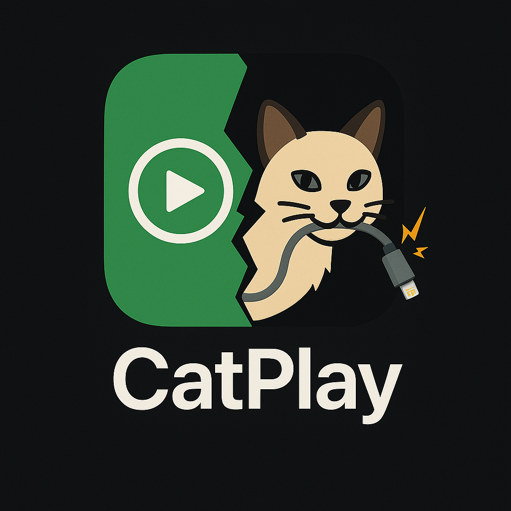

## CatPlay

CatPlay is a complete implementation of CarPlay protocol, dual-role(transmitter/receiver) with both USB and WiFi/Bluetooth support.

This includes implementations of AirPlay, HomeKit, MFi and iAP2 protocols; as well as all the necessary "glue" for the embedded Linux ecosystem.

It **DOES NOT** require any CarPlay SDKs to run - everything has been implemented from scratch - in Rust.

Thanks to that, the project stays independent of quirks assosciated with given versions of CarPlay SDK frozen in time, as well as issues caused by lack of memory safety in the SDK.

## Why?

CarPlay modding has been almost dead over last few years, and dominated entirely by buggy closed-source Chineese firmwares.

I got a popular Carlinkit wireless-to-wired adapter, but it's software quality and stability was extremely bad.

CatPlay was created so I could finally enjoy flawless wireless CarPlay in my car ;) 

The project comes with it's own "**Carplay2Air**" software, which right now is almost at feature parity with Carlinkit,
while offering much better performance and stability.

## Running
CatPlay is designed to run on so-called "wireless CarPlay dongles"; this is because an Apple MFi chip is a requirement to run it.  
  
CatPlay ships with a custom, heavily customized Yocto-based firmware.

## Firmware
The main CatPlay firmware port is the Carlinkit Mini Ultra (Ingenic X1600EN/AIC8800D80) port.  
As a result of heavy R&D, from the first public release it already offers unmatched levels of performance, stability and boot time.  

A port for legacy Carlinkit 3.0/4.0/5.0 dongles (IMX6ULL) exists, but is being sunset as a low priority port.

## Quick start
- grab your Carlinkit Mini Ultra dongle
- grab latest firmware release from [here](https://github.com/catplay-labs/catplay/releases/latest/download/clk-mini-ultra-nor.zip)
- see flashing tutorial [here](https://github.com/catplay-labs/catplay-firmware/blob/master/docs/Carlinkit%20Mini%20Ultra.md)
## Car compatibility

Some incompatibilities with different cars are expected at this stage (resulting in no detection of the dongle).  
The reasons for this have _mostly_ been mapped, however fixing them requires some trial-and-error with live access to given car, which will continue to happen over time.

| Car                    | HU               | OS                   | Compatible | Issues                                                                                                                                                                                                                                                                                                                            | Carplay SDK |
|------------------------|------------------|----------------------|------------|-----------------------------------------------------------------------------------------------------------------------------------------------------------------------------------------------------------------------------------------------------------------------------------------------------------------------------------|-------------|
| Mercedes W213          | NTG5.5           | Windows Embedded (?) | Yes        | None                                                                                                                                                                                                                                                                                                                              | 280.33.12.1 |
| Audi/Porsche ~2020 era | HARMAN MIB2/MHI2 | QNX                  | No         | - car resets power to the dongle after role switch; pending verification if other dongles bypass this and if it's related to current iAP2 logic. otherwise it works fine with externally injected power. - some fixes to support CarPlay 210.81 were made but are pending verification with live access to the car | 210.81      |
|                        |                  |                      |            |                                                                                                                                                                           

## iOS compatibility
Only iOS 26+ was tested.

## CarPlay Ultra mode

Note that CarPlay Ultra mode is currently not supported.  
If you have a spare Aston Martin 2025 with CarPlay Ultra collecting dust, please consider donating it towards the project to help development!  
(DM me for shipping instructions)

## Known limitations
- incomplete GPS sync
- incomplete "now playing" sync
- aggresive reconnects (pulling the dongle in and out several times) after few random times, trigger an iOS bug that makes it such that _all_ CarPlay invites will be ignored, until you pull out the phone and _manually_ disconnect the Wi-Fi network. there is however one way to detect this and unglitch the phone remotely, which may be implemented in the future.
- remembering the dongle's network as "auto connect" is a trigger for the exact same iOS bug. please never do this